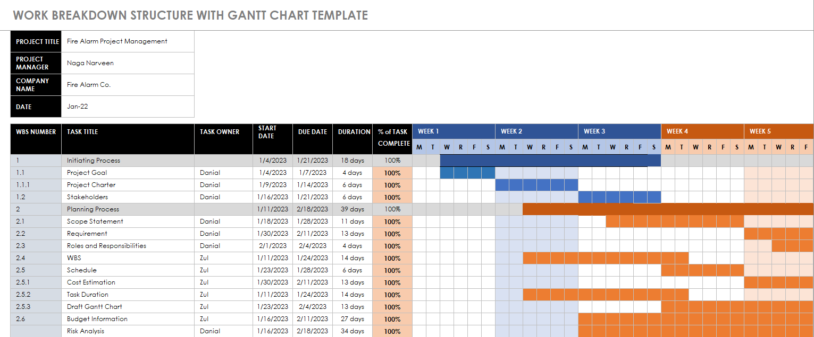

# PROJECT OVERVIEW

## E. COMPLETING THE PROJECT
### Closing Checklist
 

#### 1. Customer Acceptance Form

#### 2. Lessons Learned Document

#### 3. Final Project Report
**FIRE DETECION SYSTEM**

**1.0 PROJECT OBJECTIVES**

The fire detection system done by FA co. was intended to develop an artificial intelligence system that are able to detect fire. Not only that, we also intend to build an application programming interface (API) for the future ease if use as the integration module.

**2.0 SUMMARY OF PROJECT RESULTS**

After the system has been completed, we tested the accuracy of the system. The system is 30%

**3.0 ORIGINAL AND ACTUAL SCHEDULE**

The project member sticks to the Gantt chart scheduled so, the actual progress fits the original schedule.

**4.0 ORIGINAL AND ACTUAL BUDGET**

The actual budget matches the original budget, which means that the team has followed the budget planned at the beginning of the project and does not use any excessive money.

**5.0 PROJECT ASSESSMENT**

**5.1 SCOPE**

The project scope was initiated from the beginning of the project. The fire detection can also be done candles and small flames but the system will be able to detect that those kind of fire is not harmful. Fire in a large amount would be triggering the system to alert people in the workplace.

**5.2 OBJECTIVES**

FA co. managed to achieve the objectives initialized since the beginning of the project. A system that is artificial intelligence powered, which uses deep-learning technique has been made. Deep learning is used in this project to identify the fire in the video. 

**5.3 IMPACTS**

By creating this system, the time needed to alert everyone in a fire caught area has been reduced. This can avoid unwanted panickness created in such scenarios as safety measures would be taken as soon as fire is detected.

**6.0 TRANSITION PLAN**

FA co. staff will provide support when require. The main work of support provided by FA co.’s staff on the fire detection system project are as shown below:

i) Maintain the system

ii) Handling errors and updates of the system

iii) Provide user guidelines for IOI staff to use the system

iv) Report information to senior management on monthly basis

#### 4. Close Contract

